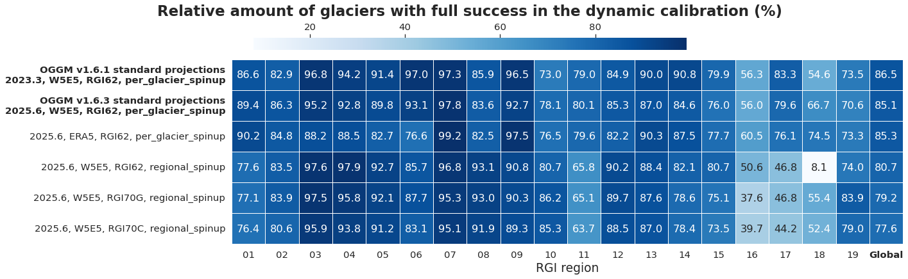

OGGM v1.6 provides preprocessed glacier directories (“gdirs”), i.e. ready-to-use datasets with all input data and standard preprocessing steps computed consistently. This post summarizes the preprocessing options and their effects on failing glaciers and volume projections.

---

**In a nutshell:**  

OGGM v1.6.1 and v1.6.3 produce nearly identical projections. Baseline climate (W5E5 vs ERA5) has little global impact but causes persistent regional differences, notably in New Zealand (region 18). Regional calibration lowers projected volumes in Central Asia (13). Updating from RGI 6.2 to RGI 7.0G reduces failing glacier area in North Asia (10) and the Caucasus and Middle East (12). Global 2000 volumes are similar, though RGI 7.0G is ~15% larger in North Asia and Caucasus/Middle East and ~15% smaller in the Low Latitudes (16) and New Zealand (18). Projection differences reflect both initial volume and regional spinup calibration. Overall, OGGM version and preprocessing differences are small compared to differences with GloGEM or PyGEM.

--- 

## Available options

- `OGGM v1.6.1 standard projections\n2023.3, W5E5, RGI62, per_glacier_spinup` ([gdir link](https://cluster.klima.uni-bremen.de/~oggm/gdirs/oggm_v1.6/L3-L5_files/2023.3/elev_bands/W5E5_spinup/RGI62/b_160/L5/)):  
  - the previous OGGM standard projections using OGGM v1.6.1, with W5E5 as baseline climate, RGI62 as glacier inventory, and dynamical spinup and calibration performed individually for each glacier  

- `OGGM v1.6.3 standard projections\n2025.6, W5E5, RGI62, per_glacier_spinup` ([gdir link](https://cluster.klima.uni-bremen.de/~oggm/gdirs/oggm_v1.6/L3-L5_files/2025.6/elev_bands/W5E5/per_glacier_spinup/RGI62/b_160/L5/)):  
  - the same as above, but using OGGM v1.6.3 with the 2025.6 preprocessed glacier directory (differences between versions described in TODO)  

- `2025.6, ERA5, RGI62, per_glacier_spinup` ([gdir link](https://cluster.klima.uni-bremen.de/~oggm/gdirs/oggm_v1.6/L3-L5_files/2025.6/elev_bands/ERA5/per_glacier_spinup/RGI62/b_160/L5/)):  
  - same as the OGGM v1.6.3 standard projections, but using ERA5 instead of W5E5 as baseline climate for the calibration. Note that ERA5 has a higher spatial resolution (0.25° × 0.25° grid) than W5E5 (0.5°).  

- `2025.6, W5E5, RGI62, regional_spinup` ([gdir link](https://cluster.klima.uni-bremen.de/~oggm/gdirs/oggm_v1.6/L3-L5_files/2025.6/elev_bands/W5E5/regional_spinup/RGI62/b_160/L5/)):  
  - same as the OGGM v1.6.3 standard projections, but the calibration for the initialization and the mass-balance model parameters (“dynamical spinup”) is performed at the regional level instead of individually for each glacier. The regional mass-balance calibration was performed in a similar way as in [Zekollari et al. (2024)](https://tc.copernicus.org/articles/18/5045/2024/), which means that every glacier is calibrated to match the regional specific mass balance instead of the individual glacier-specific mass balance. 

- `2025.6, W5E5, RGI70G, regional_spinup` ([gdir link](https://cluster.klima.uni-bremen.de/~oggm/gdirs/oggm_v1.6/L3-L5_files/2025.6/elev_bands/W5E5/regional_spinup/RGI70G/b_160/L5/)):  
  - same as above, but using the RGI70G inventory instead of RGI62. Differences between RGI versions are described [here](https://www.glims.org/rgi_user_guide/04_revisions.html), and the RGI 7.0 calibration strategy is described in [this part of the OGGM documentation (TODO, Fabien?)](TODO).  

- `2025.6, W5E5, RGI70C, regional_spinup` ([gdir link](https://cluster.klima.uni-bremen.de/~oggm/gdirs/oggm_v1.6/L3-L5_files/2025.6/elev_bands/W5E5/regional_spinup/RGI70C/b_160/L5/)):  
  - same as above, but using the glacier complex product, which results in fewer “glaciers” in total (RGI70C; [more details here](https://www.glims.org/rgi_user_guide/products/glacier_complex_product.html)) instead of individual glaciers  

Both OGGM standard projection versions are available (as regionally or globally aggregated datasets, or as per-glacier files) at https://github.com/OGGM/oggm-standard-projections-csv-files for all climate models and scenarios available from the cluster. For the other four options, we tested projections for a single climate model and several scenarios. All notebooks and data used for this blog post are available from [this OGGM cluster folder](https://cluster.klima.uni-bremen.de/~oggm/oggm-standard-projections/analysis_notebooks/1.6.3_2025_6_gdirs_proj_comparisons/).

### Error analysis 

  

Fig. 1: Failing glacier area (% of RGI area) for each region and globally for different preprocessed OGGM v1.6 glacier directories. The same figure for the number of failing glaciers is available 
<a href="https://cluster.klima.uni-bremen.de/~oggm/oggm-standard-projections/analysis_notebooks/1.6.3_2025_6_gdirs_proj_comparisons/figures/0_error_analysis_2025_6_w5e5_era5_vs_2023_3_spinup_calib_prepro_failing_glaciers_rgi6_7.png">here</a>. 
The <a href="https://nbviewer.org/urls/cluster.klima.uni-bremen.de/~oggm/oggm-standard-projections/analysis_notebooks/1.6.3_2025_6_gdirs_proj_comparisons/0_error_analysis_gdirs_oggm_v16_2025.6.ipynb">notebook used to create the figure and additional analyses</a> is also available.

  

Here, “failing glacier area” refers to the total area of glaciers for which the OGGM preprocessing workflow cannot be completed and which are therefore excluded from the projections. For all analysed preprocessed glacier directories, the glacier area that fails at any point in the OGGM preprocessing workflow is globally below 0.2%. In all regions except two (North Asia (10) and Caucasus and Middle East (12)), less than 1% of the glacier area fails.

- The failing glacier area is slightly reduced for the OGGM v1.6.3 standard projections compared to OGGM v1.6.1, likely due to the use of newer topographical maps in the Subantarctic and Antarctic Islands (region 19) (CHECK-TODO Fabien).
- Using ERA5 instead of W5E5 results in a similar failing glacier area.
- Calibrating glaciers at the regional level instead of per glacier slightly reduces the failing glacier area globally, but increases the failing glacier area in the Low Latitudes (region 16) to 0.7%.
- Using RGI70G or RGI70C instead of RGI62 (all calibrated at the regional level) drastically reduces the failing glacier area in North Asia (region 10) and the Caucasus and Middle East (region 12), from almost 4 % and 12 % to less than 0.1 %. The reason is replaced outlines in RGI 7.0 (see [1](https://www.glims.org/rgi_user_guide/regions/rgi10.html), [2](https://www.glims.org/rgi_user_guide/regions/rgi12.html)). However, in Arctic Canada North (region 03; only for RGI70G) and in the Subantarctic and Antarctic Islands (region 19; for both RGI70G and RGI70C), slightly more glacier area fails compared to RGI62. Although RGI70G results globally in around 2.5 times more failing glacier area than RGI62, the failing area remains negligible on the global scale (<0.2%). The much higher quality of RGI 7.0 and the substantial reduction of errors in some regions outweigh this increase.

### Calibration performance

  

Fig. 2: Percentage of glaciers reaching “full success” in the dynamical spinup calibration. 
<a href="https://nbviewer.org/urls/cluster.klima.uni-bremen.de/~oggm/oggm-standard-projections/analysis_notebooks/1.6.3_2025_6_gdirs_proj_comparisons/0_error_analysis_gdirs_oggm_v16_2025.6.ipynb">Notebook that created the figure and includes additional analysis.</a>

  

All preprocessed glacier directories apply the dynamical spinup, which ensures that OGGM matches the glacier area at the RGI date and the glacier mass balance during the 2000–2020 simulation, taking elevation feedbacks into account. If a glacier reaches “full success” in the dynamical calibration, this means that a melt factor can be found that matches the observed geodetic mass balance within 20% of the error estimate provided by [Hugonnet et al. (2021)](https://doi.org/10.1038/s41586-021-03436-z).

- The “full success” performance varies strongly between regions and between preprocessed glacier directories (ranging from 8 to 99% of glaciers). When calibrating each glacier individually, around 85% of glaciers globally reach full success.
- When applying the calibration at the regional level, around 5% fewer glaciers succeed globally (with around 10% fewer glaciers succeeding in five regions, but also three regions showing around 5% higher success rates). The much poorer success of the regional calibration specifically in New Zealand (region 18) may be related to the many small glaciers in that region, which have a much less negative geodetic mass balance than the regional mean ([see Zekollari et al. (2024) Fig. 1](https://tc.copernicus.org/articles/18/5045/2024/#&gid=1&pid=1)).
- Using RGI70G instead of RGI62 does not lead to important differences globally. However, using RGI70G improves the success rate by almost 40% in New Zealand (region 18) and by around 10% in the Subantarctic and Antarctic Islands (region 19), while it reduces the success rate by about 13% in the Low Latitudes (region 16).

In most regions, we find a relatively good match of the modelled regional mass change in absolute numbers ([link to figure](https://cluster.klima.uni-bremen.de/~oggm/oggm-standard-projections/analysis_notebooks/1.6.3_2025_6_gdirs_proj_comparisons/figures/1_hist_reg_mass_change_oggm_2025.6_comparisons.png)). If the dynamical spinup and the match to [Hugonnet et al. (2021)](https://doi.org/10.1038/s41586-021-03436-z) were perfect, we would expect the modelled regional 2000–2020 mass change to correspond exactly to the geodetic estimates from [Hugonnet et al. (2021)](https://doi.org/10.1038/s41586-021-03436-z). However, the dynamical spinup can fail, and even for successful glaciers the per-glacier mass balance is allowed to deviate within 20% of the reported error range.

- The largest discrepancies in absolute 20-year mass change occur in the Subantarctic and Antarctic Islands (region 19), where the mass loss obtained using RGI62 is around 50% higher than the observations from [Hugonnet et al. (2021)](https://doi.org/10.1038/s41586-021-03436-z) that were used for the calibration. Other glacier models (GloGEM, PyGEM) show a similarly strong or even larger mismatch in this region. This strong mismatch is no longer visible when using RGI70 with OGGM. One possible explanation is the lower dynamical calibration success rate for RGI62 compared to RGI70, although in other regions different success rates do not necessarily lead to different modelled regional glacier mass losses. Another explanation could be the large inventory year differences in this region, which are particularly pronounced for region 19.

When comparing regionally dynamically modelled and observed regional mass balance (dmdtda) ([link to figure](https://cluster.klima.uni-bremen.de/~oggm/oggm-standard-projections/analysis_notebooks/1.6.3_2025_6_gdirs_proj_comparisons/figures/1_hist_reg_mass_balance_comparisons_dmdtda_dyna.png)), larger discrepancies are also visible in the Low Latitudes (region 16) and in New Zealand (region 18). Some systematic differences between per-glacier and regionally calibrated gdirs are apparent in the modelled regional mass balance and may be explained by differences in how the initial area is treated and how glacier area evolves over time. The “regional_spinup” gdirs are calibrated using region-specific mass-balance values from [Hugonnet et al. (2021)](https://doi.org/10.1038/s41586-021-03436-z), which differ in some regions from the glacier-area-weighted average of the per-glacier values. This is because the per-glacier geodetic mass-balance observations are defined using a constant RGI area, while the regional values vary over time.

When considering only the fixed-geometry mass balance ([link to figure](https://cluster.klima.uni-bremen.de/~oggm/oggm-standard-projections/analysis_notebooks/1.6.3_2025_6_gdirs_proj_comparisons/figures/1_hist_reg_mass_balance_comparisons_dmdtda_fixed_geometry.png)), it becomes clear that the “regional_spinup” gdirs are calibrated towards the sometimes more negative regionally estimated mass-balance values compared to the “per_glacier_spinup” gdirs, which are calibrated using individual glacier observations. However, the absolute regional mass-change estimates are almost identical when using regional instead of per-glacier calibration (<1% difference in all regions except New Zealand (region 18), where the difference is around 2%), suggesting that integrated historical mass change may be a more robust metric to consider.

### Global and regional glacier volume projection differences 

  

Fig. 3: Glacier projection differences in 2000 and 2100 relative to the OGGM v1.6.3 Standard Projections for different OGGM v1.6 preprocessed glacier directories. Numbers are given in % relative to the 2000 OGGM v1.6.3 Standard Projections. We used only one GCM (MRI-ESM2-M) and one scenario (SSP1-2.6) for the comparison and aggregated all glaciers, even though some options contain more failing glaciers than others. Restricting the analysis to “commonly running glaciers” leads to differences of &lt;0.5% in all regions except the Low Latitudes (region 16), where differences are around 1%. For comparison, we also include the Farinotti et al. (2019) community volume estimate, which is valid at the RGI62 inventory date. 
<a href="https://cluster.klima.uni-bremen.de/~oggm/oggm-standard-projections/analysis_notebooks/1.6.3_2025_6_gdirs_proj_comparisons/figures/3_proj_all_options_plus_glogem_oggm_ssp126_one_gcm.png">Link to figure with volume projections from 2000 to 2100, including GloGEM and PyGEM</a>. 
<a href="https://nbviewer.org/urls/cluster.klima.uni-bremen.de/~oggm/oggm-standard-projections/analysis_notebooks/1.6.3_2025_6_gdirs_proj_comparisons/3_volume_projection_differences.ipynb">Link to notebook used for the analysis</a>.

  

Globally, glacier volume projection differences between the options are negligible. Differences are up to 1% in 2000 (RGI70C vs OGGM v1.6.3), decreasing to <0.1% in 2100 under SSP1-2.6 (or remaining at roughly 1% for higher-emission scenarios). Regionally, some differences are visible, but these are much smaller than the differences to GloGEM and PyGEM ([see comparison figure](https://cluster.klima.uni-bremen.de/~oggm/oggm-standard-projections/analysis_notebooks/1.6.3_2025_6_gdirs_proj_comparisons/figures/3_proj_all_options_plus_glogem_oggm_ssp126_one_gcm.png)). 

At the beginning of the projections (year 2000), the OGGM v1.6.3 Standard Projection preprocessed glacier directory is within ±8% of the Farinotti et al. (2019) community estimate in all regions, while differences reach up to 12% for the regional calibration in New Zealand (region 18). We expect regional glacier volumes in 2000 derived from OGGM using RGI62 to differ from the Farinotti et al. (2019) estimate for several reasons:

- The Farinotti et al. (2019) estimate is valid at the RGI62 inventory date, which differs substantially from the year 2000 in some regions.
- OGGM only approximately matches Farinotti et al. (2019) during the dynamical spinup, and some glacier area fails during preprocessing.
- While OGGM inversion volumes usually match Farinotti et al. (2019) well, regions 10 and 12 contain a considerable amount of failing glacier area, which likely explains why the inversion volume is around 6% smaller than the ITMIX consensus estimate ([link to figure](https://cluster.klima.uni-bremen.de/~oggm/oggm-standard-projections/analysis_notebooks/1.6.3_2025_6_gdirs_proj_comparisons/figures/1_rel_volume_difference_inversion_vs_itmix.png)).

Let's now compare the projections for each option individually:

- Differences between the OGGM v1.6.1 and v1.6.3 Standard Projections remain within 2% over the entire projection period in all regions; globally, differences are <0.5%.
- Using ERA5 instead of W5E5 leads to differences of 4–13% relative to the OGGM v1.6.3 Standard Projections in 2000 for the Caucasus and Middle East (12, Low Latitudes (16), and New Zealand (18). In New Zealand (18) and in the Russian Arctic (09) estimated absolute differences in 2100 are above 4%. Differences in regional climate evolution between the RGI date and the inversion date may explain part of the initial volume discrepancies. However, OGGM–ERA5 projections are not substantially closer to GloGEM and PyGEM, which have also used ERA5. Other differences, such as model physics, calibration and initial volumes may hide the influence of the baseline climate choice. 
- Globally and for most regions, the regional calibration does not create large projection differences, as per-glacier differences are compensated at the regional scale ([see e.g. Zekollari et al. (2024)](https://tc.copernicus.org/articles/18/5045/2024/). However, regional calibration creates an around 4% lower 2020 glacier volume in New Zealand (18) with diminishing differences until 2100. In addition, glacier volume projections in Central Asia are around 9% lower in 2100 with the regional calibration (similar tendency found for this region in [Zekollari et al., 2024 (Fig. 4)](https://tc.copernicus.org/articles/18/5045/2024/)). As this region contains the largest number of glaciers, regional calibration may affect projections there more strongly than in smaller regions.
- Because regionally calibrated “Glen A“-parameters derived from RGI62 were applied to RGI70G, any inversion volume differences between the RGI versions arise solely from updated glacier outlines rather than changes in data or methods. This results in inversion glacier volumes that are more than 10% larger in North Asia (10) and Caucasus and Middle East (12) (partly because RGI7 contains much less failing glacier area in these regions), and more than 15% smaller in the Low Latitudes (16) and New Zealand (18) ([link to figure](https://cluster.klima.uni-bremen.de/~oggm/oggm-standard-projections/analysis_notebooks/1.6.3_2025_6_gdirs_proj_comparisons/figures/1_rel_volume_difference_inversion_vs_itmix.png)). Inversion volumes are valid at different years for RGI62 and RGI70. Thus, differences between RGI62 and RGI70 preprocessed gdirs are even larger in 2000 than at inversion (Fig. 3). Over time, projection differences between RGI62 and RGI70 decrease in regions with the largest initial discrepancies. Some remaining differences in 2100 can be attributed to the regional calibration, as both RGI62 and RGI70 produce similar 2100 projections in several regions.
- Using glacier complexes (RGI70C) instead of individual glaciers (RGI70G) leads to substantial differences (>4%) in four regions in 2000 and to a ~1% larger global volume. By 2100, absolute volume differences decreased globally and in these four regions, but appeared instead in two other regions. 

### Discussion
- Should you already use the RGI70G preprocessed gdir? 
    - Probably wait until per-glacier calibrated gdirs are available.
- What does this mean for GlacierMIP4? 
    - Assuming that RGI62 is valid at the year 2000 (as planned for GlacierMIP 4) creates quite substantially different 2000 glacier volumes. 
- ... 

